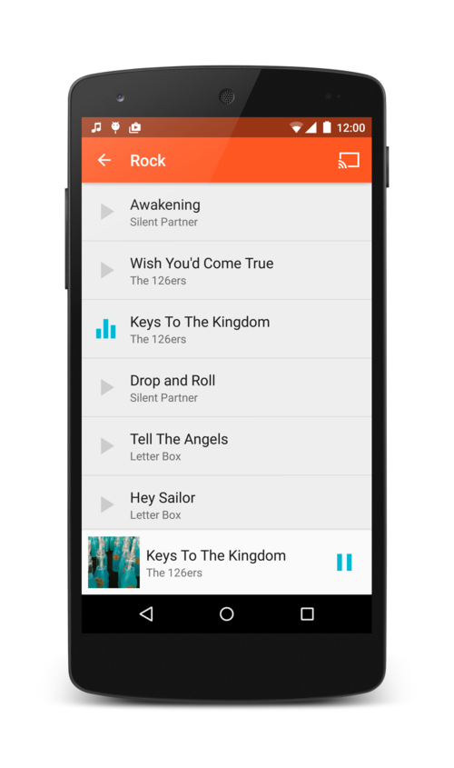
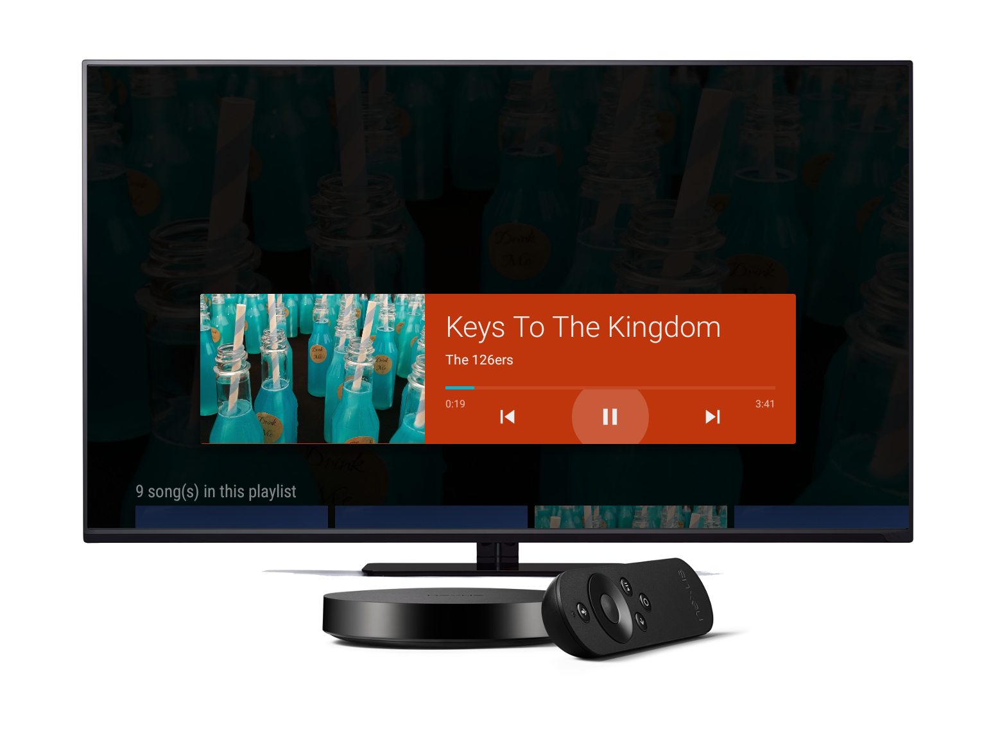
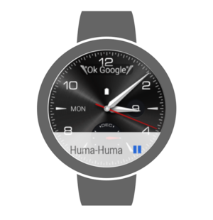

Sparkly
=====================================

This app shows implementations of an audio media app that works
across multiple form factors and provide a consistent user experience
on Android phones, tablets, Android Auto, Android Wear, Android TV and Google Cast devices.

Screenshots
-----------

